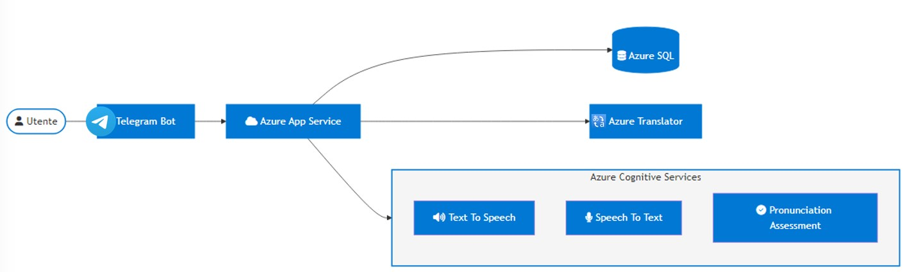

# EasyEnglish

# Requisiti
- [NodeJS](https://nodejs.org/it/download/)
- [Azure subscription](https://portal.azure.com/)
- [Visual Studio Code](https://code.visualstudio.com/)

# Configurazione

## Clone del progetto da github
- Copiare link progetto, aprire terminale e digitare 'git clone linkdelprogetto'. 
- Aprire la cartella del progetto in visual studio code

## Database Azure SQL
- Ricercare nella barra di ricerca del portale di azure 'database sql' e crearne una nuova istanza.
- Fornire i dettagli per gruppo di risorse, server e configurare il database con il servizio basic
- Confermare ed attendere la creazione dell'istanza
- Selezionare l'istanza creata e recarsi in 'editor di query', inserendo i dati per effettuare l'accesso al db
- Al primo accesso si otterrà un errore che va risolto cambiando le regole del firewall. Copiare l'indirizzo IP mostrato nell'errore, selezionare 'Panoramica' dal menù sulla sinistra ed andare su 'Impostazioni firewall server', aggiungere una nuova regola inserendo come nome regola 'ip' ed incollando l'ip copiato in precedenza nei campi 'Indirizzo IP iniziale' ed 'Indirizzo IP finale'.
- Copiare l'intero contenuto del file 'frasi.txt' nella cartella 'resources' del progetto clonato ed incollare nel db eseguendo la query
- Aprire il file 'server.js' del progetto clonato e modificare i campi contenuti in 'const config' inserendo username, password, server e nome del db scelti in fase di creazione dell'istanza del database. Il nome del server è possibile trovarlo in 'Panoramica' e 'Nome del server'.
- Modificare le impostazioni firewall del SQL server in 'panoramica/impostazioni firewall del server' consentendo alle risorse e ai servizi di Azure di accedere a questo server (impostare SI)

  
## Servizio voce azure
- Ricercare 'servizio voce' nella barra di ricerca del portale azure e creare una nuova istanza.
- Inserire dettagli del gruppo di risorse e selezionare il livello gratuito F0, confermare la creazione.
- Completata la creazione recarsi in 'chiavi ed endpoint' della risorsa appena creata.
- Aprire il file 'views/quiz.js' del progetto clonato e modificare le variabili 'subscriptionKey' e 'serviceRegion' inserendo i valori al punto precedente.

  
## Azure app service
- Creare una nuova risorsa [app service](https://docs.microsoft.com/it-it/azure/app-service/quickstart-nodejs?tabs=linux&pivots=development-environment-vscode), operazione facilitata usando vsCode. Installare l'estensione 'azure app service' in vscode e seguire il tutorial al link sopra.
- creare un bot telegram con bot father e copiare il token nel codice

  
  
# Esecuzione
## In locale
aprire telegrame ed iniziare a chattare
  
## Architettura

  
